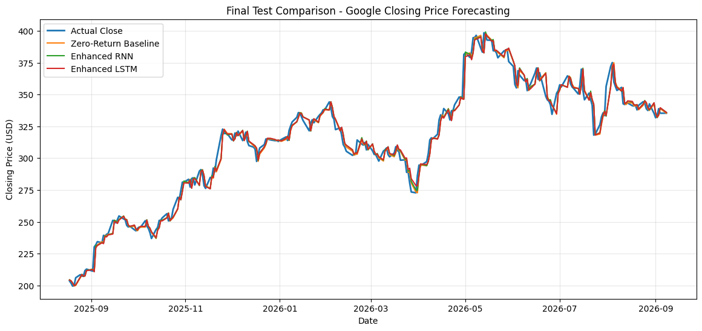
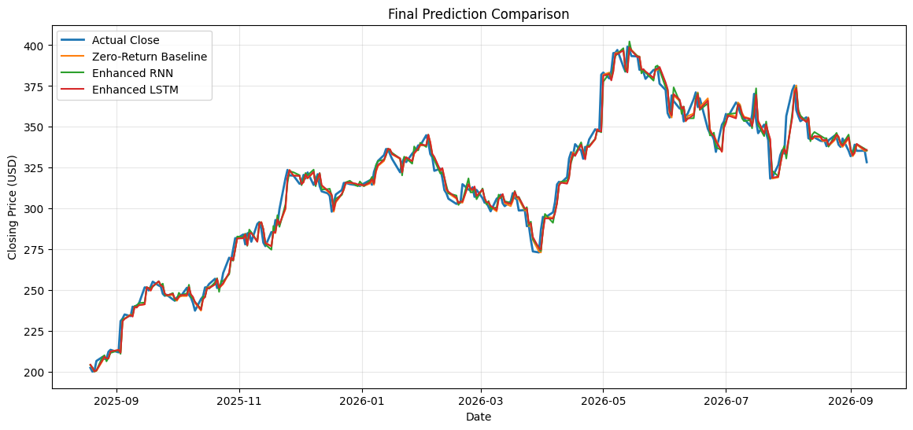

# Google Stock Forecasting with RNN & LSTM

A time-series forecasting project that compares **PyTorch** and **TensorFlow** implementations of Simple RNN and LSTM models for next-day Google (`GOOG`) stock forecasting.

The project deliberately includes strong naive baselines and evaluates whether recurrent neural networks add meaningful predictive value rather than reporting neural-network results in isolation.

## Project Scope

The workflow progresses through three stages:

1. **Direct price forecasting** using historical GOOG features
2. **Return-based forecasting** to reduce dependence on the absolute price level
3. **Enhanced return forecasting** with broader market context from `QQQ`, `SPY`, and `^VIX`

The notebooks use chronological train/validation/test splits and a **10-day lookback window**.

## Features

The analysis includes price/volume-derived features and technical context such as:

- Daily returns
- Volume change
- Open-to-close percentage change
- High-to-low percentage range
- SMA 5, 9, and 17
- Relative distance from moving averages
- Bollinger Band width
- QQQ return and volatility
- SPY return and volatility
- VIX level and return

The final enhanced feature set contains 10 features:

`SPY_Return`, `QQQ_Return`, `Close_SMA9_Pct`, `Open_Close_Pct`,
`Close_SMA17_Pct`, `Close_SMA5_Pct`, `Daily_Return`,
`VIX_Return`, `VIX_Level`, and `QQQ_Volatility_5`.

## Final Saved Results

### PyTorch

| Model | MAE | MSE | RMSE | Directional Accuracy |
|---|---:|---:|---:|---:|
| Zero-Return Baseline | **4.4274** | 40.0552 | 6.3289 | 49.62% |
| Enhanced RNN | 4.4636 | **40.0288** | **6.3268** | **50.00%** |
| Enhanced LSTM | 4.5270 | 40.8592 | 6.3921 | 46.24% |

### TensorFlow

| Model | MAE | MSE | RMSE | Directional Accuracy |
|---|---:|---:|---:|---:|
| Zero-Return Baseline | **4.4607** | **40.3660** | **6.3534** | 49.62% |
| Enhanced RNN | 4.5940 | 41.1814 | 6.4173 | **51.88%** |
| Enhanced LSTM | 4.5284 | 40.8942 | 6.3949 | 48.12% |

The saved runs show that the recurrent models **did not consistently outperform the simple zero-return/persistence baseline on price error**. The TensorFlow RNN produced a small directional edge in its saved run, while the PyTorch RNN was approximately at the majority-direction baseline.

This is an important result of the project: increasing model complexity did not automatically improve out-of-sample forecasting.

## Model Development Findings

In both implementations, direct raw-price RNN/LSTM models performed substantially worse than a persistence baseline. Switching the target from raw price to next-day return reduced that gap. Adding QQQ, SPY, and VIX provided additional market context, but the final test results still did not show a robust advantage over the naive baseline.

The project therefore treats the baseline comparison as a core part of the analysis rather than presenting the neural network outputs as evidence of reliable stock predictability.

## Visual Results

### PyTorch — Final Predictions



### TensorFlow — Final Predictions



## Repository Structure

```text
google-stock-forecasting-rnn-lstm/
├── assets/
│   ├── pytorch_final_predictions.png
│   └── tensorflow_final_predictions.png
├── data/
│   └── README.md
├── notebooks/
│   ├── pytorch_rnn_lstm.ipynb
│   └── tensorflow_rnn_lstm.ipynb
├── results/
│   ├── final_model_comparison.csv
│   └── validation_metrics.csv
├── src/
│   └── sequence_utils.py
├── .gitignore
├── README.md
└── requirements.txt
```

## Notebooks

- **PyTorch:** complete RNN/LSTM pipeline implemented with `torch`
- **TensorFlow:** parallel implementation using `tensorflow.keras`

Both notebooks contain saved outputs from their original Kaggle runs.

## Reproducibility Notes

The notebooks were created in Kaggle and contain Kaggle dataset paths. They also refresh market data with `yfinance`, so results can change when rerun at a later date.

The two framework notebooks were run separately and do not have perfectly identical saved market samples/results. For that reason, framework-to-framework differences should be interpreted as implementation/run comparisons rather than a controlled benchmark where every observation is guaranteed to be identical.

One narrative markdown cell in the original PyTorch notebook contains older directional percentages that do not match its final printed result table. This repository uses the **final printed table** as the reported result.

## Tech Stack

- Python
- PyTorch
- TensorFlow / Keras
- pandas / NumPy
- scikit-learn
- Matplotlib
- yfinance

## Possible Extensions

- Walk-forward validation
- Multiple random seeds / repeated experiments
- Transaction-cost-aware evaluation
- Additional non-neural baselines
- Gradient boosting and linear return models
- Statistical significance testing for directional accuracy
- Hyperparameter optimization without test-set leakage

## Kaggle

These notebooks were developed as Kaggle projects by **kianazesmaeili**:

https://www.kaggle.com/kianazesmaeili

## Disclaimer

This repository is an educational machine-learning project and is **not financial advice**.
